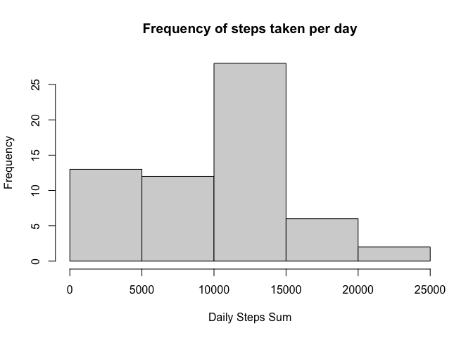
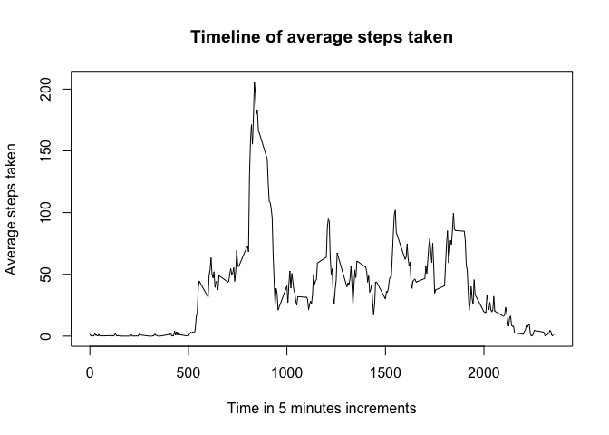
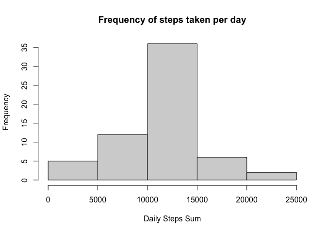
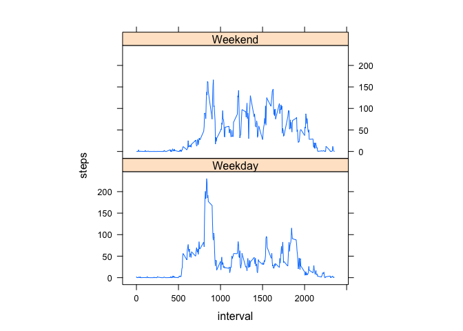

## Loading and preprocessing the data


```r
unzip("activity.zip")
act <- read.csv("activity.csv")
```


## What is mean total number of steps taken per day?

### 1. Calculate the total number of steps taken per day

```r
sumsteps <- tapply(act$steps, act$date, sum, na.rm=TRUE)
print(sumsteps)
```

```
## 2012-10-01 2012-10-02 2012-10-03 2012-10-04 2012-10-05 2012-10-06 2012-10-07 2012-10-08 2012-10-09 2012-10-10 
##          0        126      11352      12116      13294      15420      11015          0      12811       9900 
## 2012-10-11 2012-10-12 2012-10-13 2012-10-14 2012-10-15 2012-10-16 2012-10-17 2012-10-18 2012-10-19 2012-10-20 
##      10304      17382      12426      15098      10139      15084      13452      10056      11829      10395 
## 2012-10-21 2012-10-22 2012-10-23 2012-10-24 2012-10-25 2012-10-26 2012-10-27 2012-10-28 2012-10-29 2012-10-30 
##       8821      13460       8918       8355       2492       6778      10119      11458       5018       9819 
## 2012-10-31 2012-11-01 2012-11-02 2012-11-03 2012-11-04 2012-11-05 2012-11-06 2012-11-07 2012-11-08 2012-11-09 
##      15414          0      10600      10571          0      10439       8334      12883       3219          0 
## 2012-11-10 2012-11-11 2012-11-12 2012-11-13 2012-11-14 2012-11-15 2012-11-16 2012-11-17 2012-11-18 2012-11-19 
##          0      12608      10765       7336          0         41       5441      14339      15110       8841 
## 2012-11-20 2012-11-21 2012-11-22 2012-11-23 2012-11-24 2012-11-25 2012-11-26 2012-11-27 2012-11-28 2012-11-29 
##       4472      12787      20427      21194      14478      11834      11162      13646      10183       7047 
## 2012-11-30 
##          0
```

### 2. Histogram of the total number of steps taken each day

```r
hist(sumsteps, main="Frequency of steps taken per day", xlab="Daily Steps Sum")
```

<!-- -->

  We can see that the most frequent range is **10000 to 15000** steps taken in a day. 
  
### 3. Mean and median of the total number of steps taken per day  
#### Mean of steps taken per day:

```r
mean(sumsteps)
```

```
## [1] 9354.23
```

#### Median of steps taken per day:

```r
median(sumsteps)
```

```
## [1] 10395
```

The mean and the median calculations confirm what the histogram already showed us.


## What is the average daily activity pattern?
### 1. Time Series Plot  

```r
meanstpint <- tapply(act$steps, act$interval, mean, na.rm=TRUE)
plot(names(meanstpint), meanstpint, type="l", main="Timeline of average steps taken", 
     xlab="Time in 5 minutes increments", ylab="Average steps taken")
```

<!-- -->

### 2. Which 5-minute interval, on average across all the days in the dataset, contains the maximum number of steps?   

```r
which.max(meanstpint)
```

```
## 835 
## 104
```
 
   Most steps were taken **during 8:35 and 8:40**, with an average of *104*.  


## Imputing missing values

### 1. Total number of rows with NAs

```r
table(complete.cases(act))
```

```
## 
## FALSE  TRUE 
##  2304 15264
```
   
   **2304** rows have at least a NA value in them. 
   
### 2. Filling in the steps NAs with the rounded average of that 5 minute interval

```r
# I want to find out which rows have nas in the Steps column and then replace the
# NA with the average n° of steps taken in a day for the 5 minute interval of that row.
for(i in which(is.na(act$steps)))
   {namean <- match(act[i,3], names(meanstpint))
   act[i, 1] <- round(meanstpint[namean])
}
table(complete.cases(act))
```

```
## 
##  TRUE 
## 17568
```

We now see that there are no more rows with NA values.

### 3. New histogram of the total number of steps taken each day

```r
newsumsteps <- tapply(act$steps, act$date, sum)
hist(newsumsteps, main="Frequency of steps taken per day", xlab="Daily Steps Sum")
```

<!-- -->

  We can see that the most frequent range is still **10000 to 15000** steps taken in a day, 
  but the frequency is *much higher* now that we filled in the missing values.
  In return the 0 to 5000 steps per day range is a lot less frequent without NAs.

### 4. Mean and median of the total number of steps taken per day  
#### Mean of steps taken per day:

```r
mean(newsumsteps)
```

```
## [1] 10765.64
```

#### Median of steps taken per day:

```r
median(newsumsteps)
```

```
## [1] 10762
```

The mean and the median calculations confirm what the histogram already showed us
and they didn't vary that much from the previous calculations with missing values.


## Are there differences in activity patterns between weekdays and weekends?

### 1. Create a new factor variable in the dataset with two levels – “weekday” and    “weekend” indicating whether a given date is a weekday or weekend day.

```r
#Set date column class as "date"
act$date <- as.Date(act$date)
#Create a new vector of "Weekday" and "Weekend" values
day <- c()
weekend <- c("Saturday", "Sunday")
for (i in 1:17568){
  if(weekdays(act[i,2]) %in% weekend){
  day <- c(day, "Weekend")
  }
  else{day <- c(day, "Weekday")}
}
#Add the column to the existent data frame as factors 
newact <- cbind(act, day)
newact$day = as.factor(newact$day)
head(newact)
```

```
##   steps       date interval     day
## 1     2 2012-10-01        0 Weekday
## 2     0 2012-10-01        5 Weekday
## 3     0 2012-10-01       10 Weekday
## 4     0 2012-10-01       15 Weekday
## 5     0 2012-10-01       20 Weekday
## 6     2 2012-10-01       25 Weekday
```
### 2. Time Series Plot: Weekdays vs Weekend

```r
wplot <- aggregate(steps~interval+day, data=newact, FUN = mean)
library(lattice)
xyplot(steps~interval|day, data =wplot,  type="l", aspect=1/2)
```

<!-- -->
